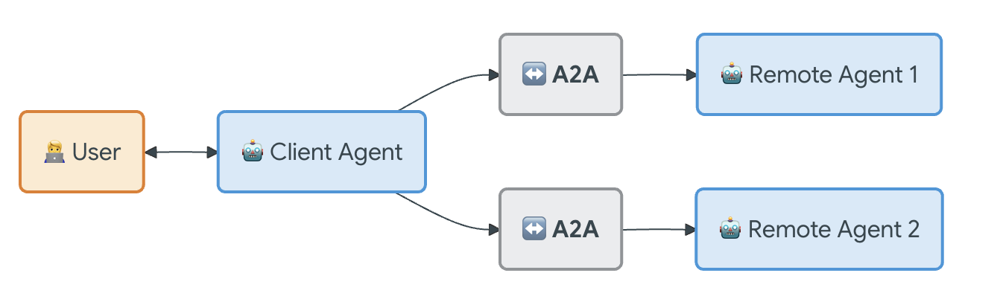

<p align="center">
  
</p>

# Multi-Agent Orchestrator System

A production-ready multi-agent system with an orchestrator pattern for coordinating specialized agents. Features intelligent routing, context-aware conversations, and a beautiful interactive dashboard with real-time communication flow visualization.

## ✨ Features

### Core Capabilities
- **Orchestrator Agent**: Coordinates queries across all agents and aggregates responses
- **Agent-to-Agent Protocol**: Standardized communication framework (A2A Protocol v1.0)
- **Independent Agents**: Each agent has separate vector database storage
- **Smart Routing**: Intelligently routes queries only to relevant agents
- **Context Awareness**: Remembers conversation history to infer user context
- **General Question Handling**: Answers non-schedule questions directly without agent coordination

### AI Integration
- **Multi-API Support**: Uses DeepSeek and Gemini APIs for parallel processing
- **Intelligent Query Detection**: Automatically detects schedule vs general questions
- **Dynamic Suggestions**: LLM-generated follow-up suggestions based on context
- **Concise Responses**: Optimized prompts for brief, clear answers

### Web Dashboard
- **Interactive Chat Interface**: Real-time chat with typing indicators
- **Animated Communication Flow**: Visual representation of agent communication with SVG paths
- **Real-time Status Monitoring**: Live agent status and query tracking
- **Communication Log**: Detailed log of all agent-to-agent communications
- **Modern UI**: Black and light blue theme inspired by InfinityFX
- **Responsive Design**: Works seamlessly on desktop and mobile

### Deployment
- **Railway Ready**: Pre-configured for Railway deployment
- **Environment Detection**: Automatically adapts to deployment environment
- **Production Optimized**: Error handling, retries, and rate limit management

### Communication Flow

The system features a beautiful animated communication flow diagram that shows:
- **Request Flow**: Blue paths showing queries from user to orchestrator to agents
- **Response Flow**: Green dashed paths showing responses back to user
- **Real-time Animation**: Nodes pulse and paths animate during processing
- **Status Indicators**: Visual feedback for each stage of communication

## 🚀 Quick Start

### Prerequisites

- Python 3.9+
- Google Gemini API key (required)
- DeepSeek API key (optional, for faster parallel processing)

### Installation

1. **Clone the repository:**
```bash
git clone https://github.com/Anujpatel04/Multi-agent-orchestrator-system-with-standardized-A2A-Protocol.git
cd Multi-agent-orchestrator-system-with-standardized-A2A-Protocol
```

2. **Create virtual environment:**
```bash
python -m venv venv
source venv/bin/activate
```

3. **Install dependencies:**
```bash
pip install -r requirements.txt
```

4. **Configure environment:**

Create a `.env` file with your API keys:
   
```bash
GEMINI_API_KEY=your_gemini_api_key_here
GEMINI_API_KEY_AGENT1=your_gemini_api_key_here
DEEPSEEK_API_KEY_ORCHESTRATOR=your_deepseek_key
DEEPSEEK_API_KEY=your_deepseek_api_key_here
```

**Note:** 
- Orchestrator uses DeepSeek API for routing and aggregation
- Agent 1 uses Gemini API
- Agent 2 uses DeepSeek API (different from Agent 1) for better parallel processing
- If DeepSeek keys are not provided, components will fallback to Gemini
- Using different APIs allows all components to process queries in parallel, making the system much faster!

5. **Run the web application:**
```bash
python web_app.py
```

6. **Access the dashboard:**
Open your browser and navigate to: `http://localhost:5001`

## 💡 Usage

### Web Interface

Start the web server:
```bash
python web_app.py
```

The dashboard provides:
- **Chat Interface**: Natural language queries with intelligent routing
- **Real-time Agent Status**: Monitor agent availability and schedules
- **Animated Flow Diagram**: Visualize communication flow in real-time
- **Communication Log**: Track all agent interactions
- **Dynamic Suggestions**: AI-generated follow-up questions

### Query Types

1. **All Agents**: Query all agents simultaneously
2. **Smart Routing**: Intelligently route to relevant agents only
3. **Find Common Time**: Agent-to-agent communication to find common free time

### Context Awareness

The orchestrator remembers conversation context:
- **Example 1**: 
  - User: "What is user 1's schedule?"
  - User: "When are they free?" (orchestrator infers "user 1")
  
- **Example 2**:
  - User: "What is the weather today?" (answered directly, no agent coordination)
  - User: "What is user 1's schedule?" (routes to Agent 1)

### CLI Interface

```bash
python orchestrator_app.py
```

Options:
1. Query all agents
2. Smart routing
3. Find common free time
4. View system summary

### Scripts

Populate sample schedules:
```bash
python scripts/populate_routines.py
```

Query agents separately:
```bash
python scripts/query_agents.py
```

##  Agent-to-Agent Protocol

The system implements a standardized A2A Protocol v1.0 for inter-agent communication:

- Standardized message format
- Message types (Query, Response, Broadcast, etc.)
- Agent registry for discovery
- Message routing and history
- Priority levels and correlation IDs

See `docs/PROTOCOL.md` for full specification.

##  UI Features

### Communication Flow Diagram

- **Interactive Nodes**: Hover effects and click interactions
- **Animated Paths**: SVG paths that pulse and flow during communication
- **Status Indicators**: Real-time status updates (Idle, Processing, Active)
- **Visual States**: Active (blue), Processing (orange), Success (green)
- **Query Counter**: Badge showing number of processed queries


### Environment Variables

Set these in your Railway project:
- `GEMINI_API_KEY`
- `GEMINI_API_KEY_AGENT1`
- `DEEPSEEK_API_KEY_ORCHESTRATOR`
- `DEEPSEEK_API_KEY`
- `PORT`

## 🛠️ Technology Stack

- **Backend**: Python 3.9+, Flask
- **AI**: Google Gemini 2.5 Pro, DeepSeek Chat
- **Database**: ChromaDB (vector database)
- **Frontend**: HTML5, CSS3, JavaScript (ES6+)
- **Communication**: REST API, A2A Protocol
- **Deployment**: Railway, Heroku-compatible

## 📝 Recent Updates

### v2.0 - Enhanced Intelligence & UI
- ✅ Context-aware user inference from conversation history
- ✅ General question handling (direct LLM responses)
- ✅ Enhanced communication flow diagram with animations
- ✅ DeepSeek API integration for parallel processing
- ✅ Improved response formatting (no markdown)
- ✅ Dynamic LLM-generated follow-up suggestions
- ✅ Real-time status indicators and animations
- ✅ Railway deployment support

### v1.0 - Initial Release
- ✅ Multi-agent orchestrator system
- ✅ A2A Protocol implementation
- ✅ Web dashboard
- ✅ Schedule management
- ✅ Agent-to-agent communication

## 🤝 Contributing

Contributions are welcome! Please feel free to submit a Pull Request.
- Google Gemini API for LLM capabilities
- DeepSeek for additional LLM support
- ChromaDB for vector database functionality
- InfinityFX for UI design inspiration
